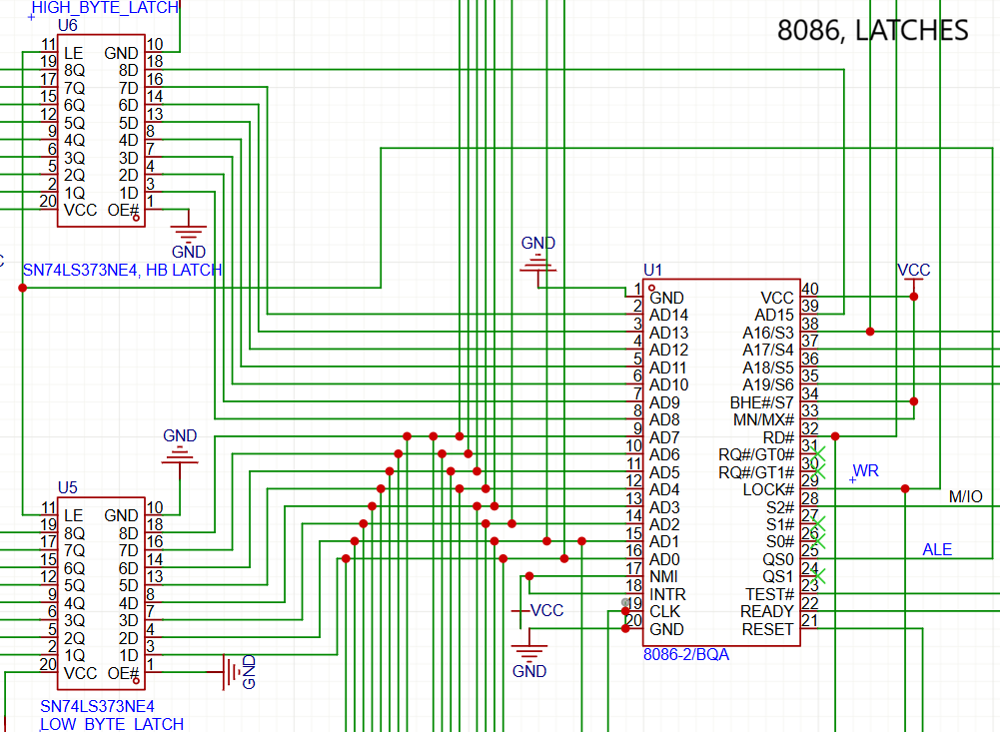
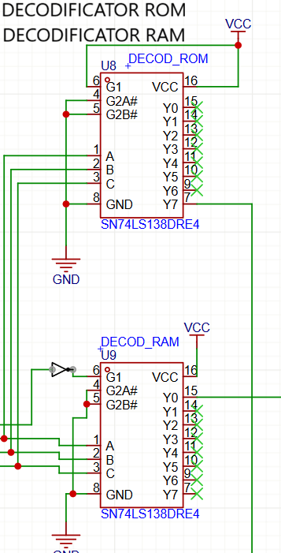
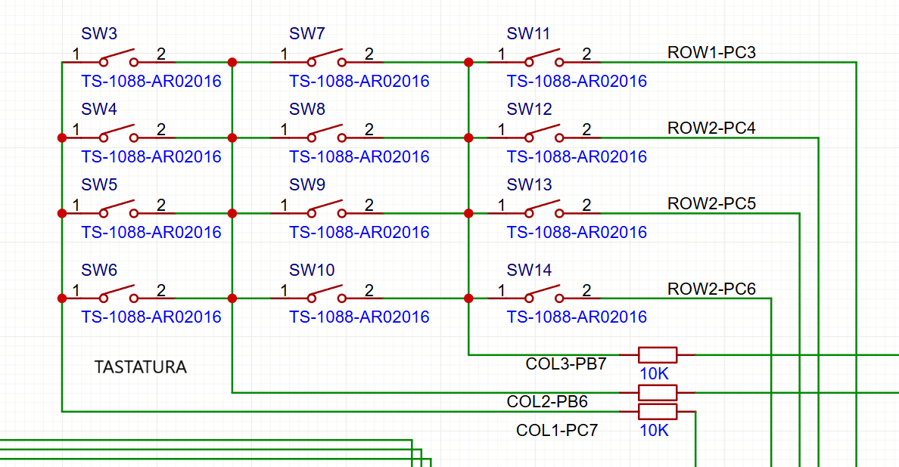
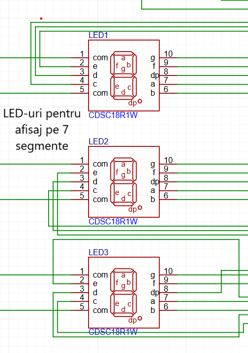

# Microsistem-Digital-cu-Microprocesorul-8086
# Microsistem Digital cu 8086

## Descriere

Acest proiect prezintă un microsistem digital bazat pe microprocesorul **Intel 8086**. Sistemul include atât interfețe de comunicație, cât și periferice pentru interacțiune și afișare.

## Componente principale

- Microprocesor: **8086**
- Interfață serială
- Interfață paralelă
- Minitastatură cu 12 taste
- Afișaj cu 7 segmente (4 digiți)
- 6 LED-uri pentru semnalizare

## Memorie

Memoria sistemului este:
- **Decodificată**
- **Stocată cu ajutorul latch-urilor**

## Funcționalitate

Microsistemul permite:
- Interacțiunea utilizatorului prin minitastatură
- Afișarea datelor pe display-ul cu 7 segmente
- Semnalizarea stărilor prin LED-uri
- Comunicarea prin interfață serială și paralelă

## Fișiere incluse

- Schema circuitului (PDF)
- Imagini ale componentelor (PNG)
- Fișier proiect EasyEDA (`.eprj`)

## Observații

Proiect realizat în scop educațional.

## Imagini Circuit

# 8086

# Decoders

# Keyboard

# 7 Segment Display

